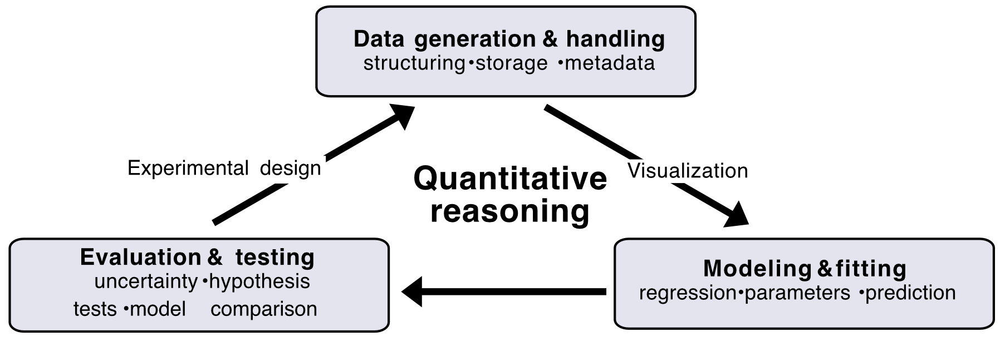

# Introduction {#sec-intro}

## The triangle of quantitative reasoning in modern biology {#sec-1atriangle}

At its core, (modern) biology is also a quantitative data science. Advances
in experimental methods to collect data, a detailed attention to
numbers, and a broad range of clever quantitative approaches have promoted
major breakthroughs in all fields of biology since more than hundred
years. Over time the trend to quantification
accelerated. Modern experimental methods, including sequencing, imaging,
metabolomics, proteomics, CRISPR screens, and single-cell technologies
promote unprecedented insights into the function of cells, organisms,
and ecosystems, through massive datasets which
need to be analyzed. Methods to collect and analyze data develop in a breathtaking speed. As a result, modern biology requires a some fundamental understanding of data handling and quantitative analysis.

Seen as quantitative data science, reasoning in biology consists of three fundamental and interconnected steps.

1.  Data generation and handling: How biological data is generated,
    organized, stored, cleaned, and structured.

2.  Modeling & Fitting: How quantitative relationships summarize patterns
    and reveal biological principles.

3.  Evaluation & Testing: How we judge models, quantify uncertainty, and
    test hypotheses

We call this here the triangle of quantitative reasoning, illustrated in
Figure [-@fig-workflow]. Across this triangle runs a natural workflow loop. Visualization connects
data to models by revealing structure and patterns. Uncertainty analyses connects
models to evaluation by quantifying variability and confidence. And
findings from the evaluation and testing informs new data generation and thus new analyses.

{#fig-workflow width="75%"}

Performing these steps efficiently and rigorously in a biological research project requires, besides a deep knowledge of the biological system one studies, an applicable knowledge in mathematics, statistics, and coding.

In this course, we introduce fundamentals of quantitative data analysis in modern biology. Starting with the basics of data handling, we will go through the triangle of quantitative reasoning, adding new analysis steps each week and applying those to real datasets through lectures and "dry labs".

::: callout-note
## Info: Popper revisited

The triangle of quantitative reasoning can be viewed as a modern, data-driven
implementation of classical scientific reasoning as articulated by Karl Popper.
In Popper's framework, science advances through the formulation of hypotheses,
the derivation of predictions, and attempts at falsification through experiment. Through the lens of data science, these statements can be made more rigorous.
Hypotheses are encoded as mathematical or statistical models, predictions are
expressed as quantitative expectations, and falsification is replaced by model
evaluation, uncertainty quantification, and comparison across datasets.
Rather than binary rejection, evidence accumulates continuously, and models are
refined or replaced as new data become available.
:::

## Biological breakthroughs through quantitative reasoning {#sec-quant-examples}

To start, let us step back and clarify why quantitative reasoning is so powerful and has become indispensable in modern biology.

Given the breathtaking progress in all areas of biology over the last century there are almost countless landmark discoveries that were possible only because of some quantitative reasoning, often as an elegant combination of careful experiments, mathematical models, and statistical analysis.

We here introduce three classical examples which changed neuroscience, biochemistry, and evolutionary biology.

1.  **Hodgkin--Huxley and the foundation of neural signaling:**
    The work of Alan Hodgkin and Andrew Huxley began with precise voltage-clamp measurements of membrane currents in the squid giant axon. Using these data together with electrical circuit theory, they constructed a quantitative mathematical model in which voltage- and time-dependent sodium and potassium conductances determine membrane dynamics (Fig. [-@fig-huxley]A).

    Notably, the kinetic and biophysical parameters of the model were constrained by voltage-clamp experiments and other independent measurements, rather than freely adjusted to reproduce action potentials. The model was then evaluated by showing that it could reproduce the timing, amplitude, and overall shape of experimentally observed action potentials (Fig. [-@fig-huxley]B,C).

    By linking ion-channel kinetics to electrical signaling, this work established a mechanistic framework for neural excitability. The Hodgkin--Huxley model became the foundation of modern conductance-based modeling approaches in neurobiology, far beyond the original experimental system, from single-neuron models to large-scale simulations of neural circuits.

    ::: callout-important
    ## Quantitative takeaway

    Quantitative analysis was essential to show how the collective behavior of many ion channels gives rise to predictable neural signals. This mechanistic link between microscopic kinetics and macroscopic electrical behavior could not be established from qualitative observations alone.
    :::

    ![**Hodgkin--Huxley and the foundation of neural signaling.** (A) Schematic of the Hodgkin--Huxley modeling framework, in which membrane voltage dynamics are described using an equivalent electrical circuit. Voltage- and time-dependent sodium and potassium conductances represent the collective behavior of ion channels. (B) Action potential predicted by the Hodgkin--Huxley model using parameters determined independently from voltage-clamp experiments and biophysical measurements. (C) Experimentally measured action potential from the squid giant axon. Model predictions and experimental data adapted from Hodgkin and Huxley (1952). The correspondence between prediction and experiment illustrates how quantitatively constrained models can link ion-channel kinetics to emergent electrical behavior.](../figs/Huxley-Hodgkin.png){#fig-huxley width="75%"}

2.  **Michaelis--Menten kinetics and the quantitative description of enzymatic catalysis:**
    Leonor Michaelis and Maud Menten investigated how enzymatic reaction rates depend on substrate concentration by systematically measuring reaction velocities across a wide range of substrate levels. They observed a characteristic saturating relationship that could not be explained by linear reasoning alone. To account for this behavior, they introduced a simple kinetic model based on enzyme--substrate binding and catalytic turnover, yielding a nonlinear rate law characterized by two parameters: the maximum reaction rate $V_{\max}$ and the Michaelis constant $K_m$ (Fig. [-@fig-mm]).

    The model was quantitatively evaluated by testing whether it reproduced measured rate--concentration curves. The introduction of $V_{\max}$ represented an important conceptual advance: it formalized the idea that enzymatic reactions are limited by a finite catalytic capacity. This insight later enabled a molecular interpretation of saturation in terms of an intrinsic turnover rate multiplied by enzyme abundance, $V_{\max}=k_{\text{cat}}[E]$, linking macroscopic rate measurements to underlying molecular processes.

    This framework became foundational in molecular biology, well beyond the original invertase experiments. A prominent later example is the $\beta$-galactosidase assay used in bacterial gene regulation, which enabled precise and reproducible measurements of enzymatic activity across conditions (Fig. [-@fig-mm]). Such quantitative assays made it possible to disentangle enzyme concentration from catalytic efficiency and helped establish how gene expression and metabolism can be described using predictive quantitative models. The same mathematical structure reappeared in microbial physiology, most notably in Monod's description of how cellular growth rates saturate with nutrient availability, highlighting the broad applicability of the Michaelis--Menten framework across biological scales.

    ::: callout-important
    ## Quantitative takeaway

    Quantitative modeling of nonlinear rate--concentration data revealed enzymatic saturation and enabled the extraction of meaningful kinetic parameters. Concepts such as $V_{\max}$, $K_m$, and ultimately $k_{\text{cat}}$ emerged through the quantitative analysis.
    :::

    ![**Michaelis--Menten kinetics as a quantitative framework for enzymatic catalysis.** (A) Original measurements by Michaelis and Menten showing reaction velocity as a function of substrate concentration for the enzyme invertase, revealing a saturating nonlinear relationship. (B) Later measurements of $\beta$-galactosidase activity using the chromogenic substrate ONPG, illustrating the same characteristic saturation behavior in a widely adopted quantitative assay. In both cases, the Michaelis--Menten model captures the observed rate--concentration curves using two parameters, $V_{\max}$ and $K_m$, providing a mechanistic interpretation of enzymatic saturation. These quantitative assays laid the foundation for modern enzymology and for subsequent quantitative studies of gene regulation and metabolism.](../figs/Michaelis_Menten_example.png){#fig-mm width="75%"}

3.  **Luria--Delbrück and the quantitative foundations of molecular evolution:**
    The work of Salvador Luria and Max Delbrück provided a quantitative resolution to a central question in evolutionary biology: whether genetic changes arise randomly or are induced by environmental challenge. Using carefully designed experiments, they measured the number of resistant bacterial colonies across many parallel cultures grown under identical phage encountering conditions. They observed extreme fluctuations in colony counts between cultures. This pattern is incompatible with mutations arising only in response to phage exposure and thus supports randomly occurring mutations. We will discuss the quantitative analysis in more detail in week 6 of this course when discussing probability and statistics. The work shape our understanding of evolution and continues to underpin modern studies of molecular evolution, population dynamics, and lineage tracing.

    ::: callout-important
    ## Quantitative takeaway

    Quantitative analysis of population-to-population variability was essential to distinguish random mutation from environmentally induced change---an inference that could not be drawn from qualitative observations or single experiments.
    :::

**Modern biology**: Quantitative analysis plays an equally central role in modern experimental biology. As experimental techniques now generate data at unprecedented scale and complexity, systematic quantitative analysis is essential for extracting meaningful biological insight. Consider, for example, the many modern biological approaches that can be understood as high-dimensional extensions of the classical examples discussed above. In neuroscience, large-scale recording and connectomics aim to link neural structure and activity to function across entire circuits, extending the Hodgkin--Huxley logic from single neurons to networks of thousands or millions of cells. In metabolism, omics technologies such as proteomics and metabolomics provide global measurements of enzyme abundances and metabolite concentrations, which are increasingly interpreted through quantitative frameworks such as metabolic and resource-allocation models that build directly on Michaelis--Menten kinetics. In evolutionary biology, lineage barcoding and sequencing-based tracking experiments allow researchers to follow the fate of thousands of lineages in parallel, bringing the probabilistic logic of the Luria--Delbrück experiment into a genomic, time-resolved setting.

Across these domains, experimental advances require quantitative analysis to identify structure in high-dimensional data, evaluate competing models, and extract meaningful biological insight.

## This course, dry labs to learn quantitative analysis and a note for beginners

Before we start we want to emphasize important aspects of this course.

**Scope and limitation of this course**: In this class, we will only consider a small part of the remarkable breath of quantitative methods, focusing on the most essential and those important for modern omics analyses. Second, we will focus on the conceptual logic of analysis steps and their realization in Python and hands on computational notebooks, not mathematical proofs or rigor. The goal is a applicable understanding of essential steps, to utilize in research projects and to promote further studies of quantitative methods.

**Dry labs:** To learn quantitative analysis, we believe it is essential to apply concepts immediately to real datasets. In this course, we realize this hands-on approach through "dry labs" as problem sets. Each dry lab is built around a (Python based) computational notebook, an interactive document that combines narrative text, executable code, and visual or numerical output in a single workflow. Using this format, we introduce new analysis concepts, apply them directly to data, and interpret the results in context.

**Different quantitative backgrounds**: Students in this course arrive with a wide range of backgrounds in coding, mathematics, statistics, and biology. Some topics may feel familiar, while others may be entirely new. The dry labs and accompanying scripts are structured to support students with less prior experience by building foundational skills step by step. Students with more advanced backgrounds can revisit core ideas and deepen their understanding by analyzing datasets of their choice or engaging with optional problem sets.

For those of you who are new to coding or to many of the mathematical and statistical concepts introduced in this course, we want to emphasize that getting started is more feasible than ever before. Modern programming tools, extensive documentation, and AI have substantially lowered the barrier to entry. At the same time, becoming comfortable with quantitative analysis still involves a learning curve and can feel challenging at first. It takes time to get used to the analysis workflow, become familiar with available tools, and develop a conceptual understanding of the essential analysis steps. To overcome this hurdle and make coding and quantitative analysis a routine part of your scientific workflow, we strongly encourage you to work collaboratively and learn together. We are also here to help.

::: callout-note
## Info: Tutorials and office hours

To support students at all levels, the course offers optional introductory sessions during the first two Thursdays, an optional Thursday afternoon support session each week, and additional office hours throughout the quarter. We strongly encourage you to take advantage of these resources as you navigate the course.
:::

## Use of AI tools

Before starting, we want to briefly address the use of AI tools. Large language models and AI systems such as OpenAI ChatGPT, Google Gemini, or Anthropic Claude are developing at a remarkable pace. These tools are particularly effective for coding and data analysis and can substantially accelerate quantitative workflows in the life sciences.

AI can assist with writing and debugging code, exploring unfamiliar analysis approaches, and reducing the time required to implement computational methods. At the same time, it remains essential to maintain a solid conceptual understanding of the methods and analysis steps being used. We recommend doing introductory coding over the first few weeks of the with little to no use of AI for writing the code itself. However, AI tools (or forums such as stack overflow) are useful for debugging or helping with you're stuck. Also be sure to look at and engage with any code generated by AI; AI hallucinations are real, and uncritical or overly reliant use of AI tools can lead to misleading or even blatantly incorrect analysis results.

We also want to encourage you to use AI responsibly, with consideration for the large environmental impact that AI has; as of now (and we expect for the foreseeable future), AI it requires an enormous amount of energy and water use. We link materials for a further discussion of this issue in Canvas.

### Using AI tools effectively and responsibly

To use AI tools productively while avoiding common pitfalls, we recommend the following practices:

::: callout-tip
## Best practice: Using AI effectively and responsibly

- **Break tasks into small steps.** Ask for help with specific tasks rather than entire analysis pipelines.

- **Ensure you understand the code generated with AI assistance.** Verify that you follow the logic of the code. If unsure of specific steps, you can ask the AI to explain what the code does and why.

- **Provide all the information needed when formulating an AI request.** E.g. provide explicit information about data structure, column names, units, analysis goals. Supplying a table header or a short data description often leads to much more useful suggestions.

- **Test the code output** As with any code, AI-generated code must be tested and analysis results must be validated. E.g. test code on small datasets or in limiting cases where the expected outcome is known.

- **Protect sensitive data.** Do not share confidential, identifying, or unpublished data with AI tools.
:::

### AI use in this course

In this course, we encourage the use of AI tools with a few exceptions.

**AI when using problem sets.** You may use AI tools to help set up analyses, explore code, and troubleshoot issues. Exceptions are problems or checkpoints explicitly marked as `no AI`, which must be completed without AI assistance to assess your own understanding.

**AI during the project phase.** You may also use AI tools during the final project phase for tasks such as coding, data wrangling, or plotting. Any such use must be disclosed in both the written report and the presentation (for example, a brief note describing what the AI was used for). You may not use AI tools to write the main text of the final project report; the scientific narrative and interpretation must be your own.

| **Course component**                            | **AI use allowed** |
|:------------------------------------------------|:------------------:|
| Problem sets (problem marked `no AI`)           |         No         |
| Problem sets (all other problems)               |        Yes         |
| Final project: data analysis and coding         |        Yes         |
| Final project: writing and scientific narrative |         No         |

: Summary - AI use in this course {#tbl-ai-rules-simple}
