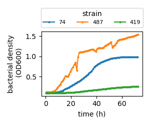

# Datasets in this course

In this course, we will analyze several real datasets to illustrate common quantitative approaches in biology.

We will use a relatively compact "reference dataset" on bacterial growth to illustrate how to iterate through different analysis steps across the next five weeks, from data handling and initial data visualization to model fitting and hypothesis testing. We'll also include some exercises in which you can choose to use other datasets.

Additional datasets will showcase different omics methods and allow data exploration across diverse biological systems.

## Reference Dataset: Microbial growth analysis by Smith *et al.*

Our primary reference dataset is a collection of microbial growth curves from a recent high-throughput experiment by Smith *et al.* (2024). We chose this dataset because it is rich enough to support multiple quantitative analyses while remaining conceptually and computationally accessible early in the course.

### Biological context

Human activity has introduced chemical pollutants into many ecosystems, for example through agriculture, industry, and medicine. These pollutants, alone or in combination, can strongly affect microbial populations, which in turn can alter entire ecosystems and even geochemical cycles.

To begin understanding the potential impact of pollutants on microbes, it is essential to investigate microbial growth. Growth is a hallmark of microbial life: how fast microbes grow determines how populations expand, compete, and persist in natural environments. Because microbes in real environments are typically exposed to multiple pollutants simultaneously, Smith *et al.* measured the growth of different bacterial species under a wide range of chemical conditions. In their study, different bacterial strains were exposed to eight single chemicals commonly encountered in freshwater environments (Table [-@tbl-smith-design]), as well as their combinations, resulting in 255 distinct chemical mixtures plus control conditions.

::: {#tbl-smith-design layout="[42,54]"}

| **Chemical**    | **Env.** | **Target**  |
|:----------------|:---------|:------------|
| Amoxicillin     | Urban    | Antibiotic  |
| Chlorothalonil  | Rural    | Fungicide   |
| Diflufenican    | Rural    | Herbicide   |
| Glyphosate      | Urban    | Herbicide   |
| Imidacloprid    | Urban    | Insecticide |
| Metaldehyde     | Rural    | Insecticide |
| Oxytetracycline | Rural    | Antibiotic  |
| Tebuconazole    | Urban    | Fungicide   |

: Chemical stressors

| **ID** | **Species**                 | **Phylum / Class**  |
|:-------|:----------------------------|:--------------------|
| 74     | *Neobacillus soli*          | Firmicutes          |
| 100    | *Pseudomonas baetica*       | Gammaproteobacteria |
| 302    | *Flavobacterium glaciei*    | Bacteroidetes       |
| 306    | *Arthrobacter humicola*     | Actinobacteria      |
| 331    | *Pseudomonas baetica*       | Gammaproteobacteria |
| 371    | *Rhizobium herbae*          | Alphaproteobacteria |
| 419    | *Sphingomonas faeni*        | Alphaproteobacteria |
| 448    | *Carnobacterium gallinarum* | Firmicutes          |
| 487    | *Aeromonas popoffii*        | Gammaproteobacteria |
| 527    | *Arthrobacter humicola*     | Actinobacteria      |
| ---    | *Escherichia coli*          | Gammaproteobacteria |
| ---    | *Aliivibrio fischeri*       | Gammaproteobacteria |
| Mix    | Environmental mixture       | Multiple phyla      |

: Bacterial strains

**Experimental design of the Smith *et al.* bacterial growth study.** The experiments systematically combined eight chemical stressors representing common anthropogenic pollutants with a diverse set of bacterial isolates. Growth was measured across chemical combinations and strains.
:::

### Measuring bacterial growth

To quantify how fast bacterial populations grow, changes in population biomass must be tracked over time. In practice, these growth curves are commonly measured using light absorbance or optical density (OD). Measured at a specific wavelength (often OD600), OD is a commonly used proxy for bacterial biomass in liquid culture. A few typical growth curves are shown in Figure [-@fig-growth-curve].

{#fig-growth-curve width="30%"}

Such curves exhibit characteristic phases: an initial phase of slow growth (lag phase), a phase of rapid growth (exponential or log phase), and a phase where optical density no longer increases (stationary phase). The growth rate quantifying the speed of growth can be extracted by analyzing how steep the growth curve is during exponential growth. We will return to this analysis in detail next week, when we discuss model fitting and uncertainty.

To obtain these growth curves for many culture conditions, Smith *et al.* used plate-reader experiments, where many culture conditions can be measured in parallel using 96-well plates and optical density can be recorded automatically over time.

### Organization and structure of the dataset

Following good practices in transparent science, Smith *et al.* made their raw and processed data publicly available via a dedicated GitHub repository (<https://github.com/smithtp/isolate-chem-mixtures>) .

In this course, we will focus on the raw growth curve data. We will extract growth rates, analyze uncertainty across replicates, and test whether growth rates differ significantly across chemical stressor conditions.

The growth curve data are provided in a single combined file. To work effectively with this dataset, it is important to understand its organization. Each growth curve is indexed by (i) the bacterial strain, (ii) the specific combination of chemical stressors, and (iii) the replicate number (alternatively strain, replication, plate, and well numbers also uniquely define growth curves). Together, these identifiers uniquely define each observation. See Dry Labs 1 and 2 for further discussion.

::: callout-note
## Info

This example from microbial ecology has broader relevance than one might first think. First, time series analysis and the quantification of variability across strains, conditions, and replicates arise in many biological contexts, making this dataset analysis broadly transferable. In addition, growth is fundamentally intertwined with gene expression and proteome composition, themes we will revisit later in the course.
:::

## Other datasets

In addition to the reference growth dataset, we will look in this course at different omics datasets from recent studies.

### Change in proteome composition during synapse development

**Summary:**

As a first example, we include a large-scale proteomics dataset describing how the molecular composition of synapses changes during brain development. The dataset was published in a recent study by Wang et al ([https://www.nature.com/articles/s41564-024-01626-9
](https://www.nature.com/articles/s41564-024-01626-9
){.uri}).

The study quantified the abundance of more than 1,000 synaptic proteins across developmental stages in humans and two other species. This dataset exemplifies the power of modern quantitative analyses in neurobiology.

**Biological context:**

Synapses are the fundamental units of communication between neurons, and their molecular composition changes substantially during brain development. To study these changes, the dataset provided here quantifies protein abundance in the *postsynaptic density* (PSD), a specialized protein complex at excitatory synapses.

The study used mass spectrometry to measure PSD protein abundance across developmental stages in human, macaque, and mouse. In humans, samples were collected from two cortical regions: the prefrontal cortex (PFC), an association cortex region that matures relatively late, and the primary visual cortex (V1), a sensory region that matures earlier. Macaque and mouse datasets provide complementary cross-species comparisons of synapse development.

**Organization of the dataset:**

For each sample group (human PFC, human V1, macaque, and mouse), the original study provides a table in which rows correspond to proteins (identified by UniProt ID, gene name, and Entrez ID) and columns show different biological samples. A separate metadata table links each sample to biological information such as developmental age or age group, cortical region, and sex.

To facilitate data exploration and analysis, we provide a reformatted tidy version of the data. In this tidy table, each row represents a single measurement: the abundance of one protein in one sample. Columns encode protein identifiers, sample identifiers, species, cortical region, developmental stage, and measured protein abundance. In addition, a separate sample-metadata table contains one row per sample and describes the biological context associated with each measurement.

### Changes in cellular proteome composition across growth conditions

**Summary:**

As a second example, we provide a large-scale proteomics dataset describing how the protein composition of *Escherichia coli* changes across different growth conditions. The dataset, published in a recent study by Chure et al ([https://www.nature.com/articles/s41467-025-67553-3
](https://www.nature.com/articles/s41467-025-67553-3
){.uri}) combines protein abundance measurements from many independent studies and labs into a unified, curated format. It illustrates why growth (and more generally the metabolic state of cells) is such a central control variable in cellular physiology and why it should be considered explicitly when studying cellular processes. The dataset also exemplifies the value of systematic cross-study comparisons to judge reproducibility.

**Biological context:**

Cell growth requires the coordinated allocation of cellular resources to make new biomass, including proteins involved in metabolism, biosynthesis, transport, and regulation. Changes in environmental conditions such as nutrient availability can strongly alter this coordination, affecting proteome composition and growth rate. Understanding how cells reorganize their proteome across conditions is therefore a central question in cell physiology and a prerequisite for systems-level insights into how cells function.

Proteome reorganization has been studied extensively in model organisms including *Escherichia coli*. Here, we provide an *E. coli* dataset derived from a recent study that quantified the condition-dependent partitioning of proteins across cellular compartments, including cytoplasmic, membrane-associated, and periplasmic proteins. Beyond compartmentalization, the dataset can be used more broadly to explore relationships between growth rate, protein allocation, and environmental variation. Because the dataset integrates proteome measurements from many different laboratories, it also enables systematic cross-laboratory comparisons to assess reproducibility.

**Organization of the dataset:**

The data focus on steady growth on different carbon sources. Measurements from different studies were converted into a joint tidy format, allowing direct comparison across experiments. The tidy data table contains one row per protein measurement in one experimental condition. Columns encode the bacterial strain, carbon source, replicate number, protein identifier (gene or protein name), study source, cellular localization, functional annotation, growth rate, and measured protein abundance (mass fraction). Each observation is uniquely identified by the combination of strain, carbon source, replicate, protein identity, and data source.

### Transcriptional dynamics during the yeast metabolic cycle

**Summary:**

As a third example, we include an RNA-seq dataset describing transcriptional dynamics during the yeast metabolic cycle. The dataset collected by Gowans et al. (<https://www.cell.com/molecular-cell/abstract/S1097-2765(19)30734-8>) captures genome-wide gene expression changes over time in both wild-type budding yeast *Saccharomyces cerevisiae* and a targeted regulatory mutant. It provides a time-resolved view of how cellular metabolism, chromatin regulation, and gene expression are inherently coupled.

**Biological context:**

The yeast metabolic cycle is a well-studied oscillatory program in which cellular metabolism alternates between distinct phases characterized by different oxygen consumption rates, redox states, and biosynthetic activities. These metabolic oscillations are tightly coupled to transcriptional regulation: thousands of genes are periodically activated or repressed in synchrony with metabolic state.

Understanding how gene expression dynamics are coordinated with metabolic cycles is central to systems biology, as it reveals how cells temporally organize energy production, biosynthesis, and growth.

In this study, the authors used RNA sequencing to measure genome-wide transcriptional changes across successive phases of the metabolic cycle in wild-type yeast and in a mutant carrying a point mutation in the chromatin-associated transcription factor *TAF14* (W81A). Taf14 contains a YEATS domain that binds histone crotonylation, a chromatin modification linked to metabolic flux. The W81A mutation disrupts this interaction, thereby uncoupling metabolic state from chromatin-mediated transcriptional repression.

By comparing wild-type and *TAF14* W81A cells, the study tests whether transcriptional oscillations arise directly from metabolic state or whether they depend on chromatin-based regulatory mechanisms that sense metabolic flux.

**Organization of the dataset:**

The dataset is available as processed RNA-seq tables deposited in the Gene Expression Omnibus (GEO, accession GSE120019), containing gene expression measurements across multiple time points during the yeast metabolic cycle.

The tidy data table we provide contains one row per gene, per time point, and per genotype. Columns encode the systematic gene identifier (and name when available), time point within the metabolic cycle, genotype (wild-type or *TAF14* W81A), and normalized RNA abundance. Additional columns report statistical results from the original differential expression analysis, including log-fold changes and adjusted p-values.

Each observation is uniquely identified by the combination of gene identifier, time point, and genotype. This structure makes it easy to explore temporal expression patterns, compare wild-type and mutant dynamics, and link transcriptional changes to metabolic state.

### Single-cell transcriptomics in yeast

**Summary:**

As a fourth example, we include a single-cell RNA-seq dataset from the budding yeast *Saccharomyces cerevisiae*, generated by Jackson *et al.* (eLife, 2020). This dataset contrasts bulk RNA-seq measurements with single-cell transcriptomic profiles collected under different environmental conditions. It illustrates how high-dimensional molecular measurements at single-cell resolution reveal heterogeneity that is invisible in population-averaged data.

**Biological context:**

Bulk transcriptomic measurements report the average gene expression across many cells, implicitly assuming that the population is homogeneous. In reality, even genetically identical cells growing in the same environment can exhibit substantial cell-to-cell variability in gene expression. This variability can reflect stochastic gene expression, differences in metabolic state, cell-cycle position, or adaptive responses to environmental stress.

In this study, the authors used single-cell RNA sequencing to measure genome-wide gene expression in individual yeast cells grown under three conditions: rich medium (YPD), carbon starvation (CStarve), and growth on proline as the sole nitrogen source. These conditions induce distinct physiological states and levels of transcriptional heterogeneity. By comparing bulk and single-cell measurements, the dataset highlights how population averages can hide variability present at the single-cell level.

**Organization of the dataset:**

The dataset provided in this course consists of two complementary parts. First, bulk RNA-seq data were collected from actively growing yeast cultures in rich medium (YPD), with five biological replicates. In this table, each row corresponds to a replicate and each column corresponds to a gene, representing population-averaged expression levels.

Second, single-cell RNA-seq data were collected from individual yeast cells across the three growth conditions (YPD, CStarve, and Proline). In the single-cell table, each row represents one cell and each column represents a gene. Additional metadata columns encode experimental condition, batch information, and cell-level quality metrics.

We provide the original data tables published. Note that this is not a tidy data format as such a formatting would lead to unpleasantly large file sizes.
