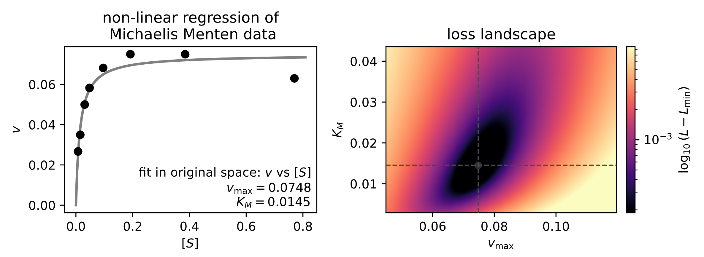

# Non-linear regression

## Biology is inherently non-linear

Many biological processes involve **thresholds**, **saturation**, **cooperativity**, **feedback**, and **limited resources**. As a result, relationships in biological data are typically inherently non-linear, and it is important to go beyond linear regression.

Non-linearity means that changes in an input variable do not lead to proportional changes in the output. Combined effects do not simply add together, and small changes in conditions can produce large qualitative shifts in behavior. Mathematically, instead of straight lines (or planes), relationships are often described by curved, sigmoidal, or saturating functions. See the box for a few examples.

::: callout-note
## Info: Examples of non-linear behavior in biology

1.  **Enzyme kinetics.**
    Reaction rates saturate at high substrate concentrations because enzymes have finite catalytic capacity, as described by the non-linear Michaelis--Menten relation. Reaction rates also depend in complex, non-linear ways on temperature, pH, and intracellular salt concentrations.

2.  **Microbial growth.**
    Growth is commonly exponential (not linear) under nutrient-replete conditions. Growth rates increase non-linearly with nutrient availability and saturate once uptake or metabolism becomes limiting.

3.  **Gene regulation.**
    Transcriptional regulation and cellular signaling are highly non-linear processes, often exhibiting steep sigmoidal responses with strong cooperativity, such that small changes in concentration can lead to large, almost switch-like changes in gene expression.

4.  **Feedback-driven dynamics.**
    Positive and negative feedback loops can generate bistability or oscillations, as observed in metabolic regulation, circadian rhythms, and development. These behaviors have no linear analogue.
:::

In summary, biological processes are often highly non-linear, with characteristics such as saturation, thresholds, and steep transitions that cannot be captured by linear models. Consequently, non-linear regression is an essential tool for quantitative biological analysis.

## The idea of non-linear regression

How does non-linear regression work?

Conceptually, non-linear regression builds on the same logic as linear regression. Given a dataset $(x_i, y_i)$ and a model
$$y = f(x; \boldsymbol{\phi}),$$
we seek parameter values $\boldsymbol{\phi}$ that best describe the data. Here, $\boldsymbol{\phi}$ generally denotes a vector of multiple model parameters rather than a single coefficient.

As in the linear case, parameter estimation is formulated as an optimization problem. A common choice of loss function is the sum of squared residuals,
$$\mathcal{L}(\boldsymbol{\phi}) = \sum_i \left(y_i - f(x_i; \boldsymbol{\phi})\right)^2.$$

The crucial difference from linear regression is that $f$ is now a genuinely non-linear function rather than a straight line. Notably, for non-linear functions there is typically no closed-form analytical solution for finding the parameter values that minimize the loss. Instead, non-linear regression relies on numerical optimization methods.

We do not discuss here in depth the many numerical algorithms that enable non-linear regression. Instead, we provide an intuitive picture of the optimization process using the concept of an *error landscape*. Each point in parameter space corresponds to a particular parametrization of the model, and the loss function assigns a height to each point, quantifying how well that parametrization describes the data. Performing regression then becomes the task of navigating this landscape to find a (potentially global) minimum.

Numerical optimization methods generally aim to find a minimum of a loss (or objective) function defined over a parameter landscape. A large and important class of these methods---iterative algorithms---operate by starting from an initial point in parameter space (often chosen heuristically or at random). At each iteration, the algorithm uses information about the local geometry of the loss function, such as its slope (the first derivative) and, in some cases, its curvature or concavity (the second derivative). Methods differ in how this information is obtained: when analytic expressions for derivatives are available, they may be used directly; otherwise, derivatives can be approximated numerically. Based on this local information, the algorithm updates the parameter values in a direction expected to reduce the loss and repeats this process until a convergence criterion is met (e.g., the change in parameters or loss becomes sufficiently small). Generally, if the slope is very large, a larger step is taken, and if the function is very curved a smaller step is taken.

::: callout-note
## Info: Gradient Descent

Gradient descent is one of the simplest and most widely used iterative optimization algorithms.
At each iteration, the parameters are updated in the direction of the negative gradient of the
loss function, which corresponds to the direction of steepest descent.

Let $\theta$ denote the parameter vector and $L(\theta)$ the loss function.
The update rule is
$$\theta_{k+1} = \theta_k - \eta \, \nabla L(\theta_k),$$
where $\eta > 0$ is the *learning rate*.

The learning rate determines the step size at each iteration.
Large values may cause divergence, while small values can lead to slow convergence.
Because gradient descent relies only on first-order derivative information, it is
computationally efficient but may converge slowly in poorly scaled or highly curved landscapes.
:::

Beyond basic gradient descent, many optimization algorithms modify how derivative information is used to improve convergence or robustness. Newton's method and quasi-Newton methods (such as BFGS and L-BFGS) incorporate second-order curvature information, either exactly or approximately, to rescale parameter updates. "Conjugate gradient\" methods are often used for large, sparse problems. In settings where derivatives are noisy or expensive, stochastic gradient descent and its variants (e.g., momentum, RMSProp, Adam) are common. Finally, derivative-free methods such as Nelder--Mead or evolutionary algorithms can be useful when gradients are unavailable or unreliable. Together, these methods form a toolbox whose appropriate choice depends on the structure of the problem, the cost of evaluating the loss, and the dimensionality of the parameter space.

## Example: non-linear regression of enzyme kinetics

As an example of non-linear regression, we return to the enzyme kinetics data from Michaelis and Menten and now fit the original non-linear Michaelis--Menten model directly to the data. Unlike the linearized approach introduced earlier, this method preserves the original error structure of the measurements and yields parameter estimates that are less sensitive to distortions introduced by transformations.

Figure [-@fig-mm-nonlinear-fit] shows the best-fit non-linear regression curve together with the experimental data.

Notably, the inferred parameters for $K_m$ and $v_{\max}$ are here very similar to those obtained from the linearized regression approach. However, in general this agreement should not be expected, and linearizing transformations can substantially bias parameter estimates.

{#fig-mm-nonlinear-fit width="75%"}

## The challenges of non-linear regression

At first sight, finding a minimum in an error landscape may appear straightforward. However, error landscapes are often highly complex: they may be steep in some directions, flat in others, and can contain multiple local minima. As a result, identifying good solutions can be challenging.

Several practical difficulties commonly arise:

- The algorithm may converge to a local rather than a global minimum.

- Results can depend strongly on the initial parameter guesses.

- Step sizes matter: overly large steps may cause divergence, while very small steps lead to slow convergence.

- Flat regions of the landscape can substantially hinder progress.

These challenges become more pronounced as the number of fitted parameters increases. An intuitive picture based on a two-dimensional landscape can strongly underestimate the difficulty of optimization in higher-dimensional parameter spaces.

While modern numerical libraries implement sophisticated strategies to mitigate these issues, non-linear regression remains inherently more fragile than linear regression and requires careful evaluation of results. Choosing appropriate initial parameter values, checking convergence, and validating fits are essential steps in obtaining reliable results and often require substantial manual intervention and judgment.

See Problem Set 3 for hands-on examples of performing and evaluating non-linear regression using standard computational tools.

## The importance of evaluation

Importantly, while non-linear regression is an essential and powerful tool, it also requires substantially more care than linear regression. Because non-linear regression uses numerical optimization, successful running of an algorithm alone does not guarantee that the resulting parameters are meaningful or reliable.

In practice, non-linear fitting should always be viewed as an *interpretive* step rather than a purely mechanical one alone. A fitted curve may visually appeal in good agreement with the data but still reflect an inappropriate model structure, poorly constrained parameters, or numerical artifacts of the optimization procedure. For this reason, every non-linear fit must be evaluated critically.

At a minimum, one should assess whether the fitted model captures the major trends of interest in the data without introducing systematic deviations, whether inferred parameter values are biologically plausible, and whether the data actually constrain the parameters of interest (see box).

::: callout-note
## Info: Practical guidance for evaluating non-linear fits

When interpreting a non-linear regression, it is good practice to ask:

- Does the fitted model systematically miss parts of the data, or does it capture the overall trend?

- Do residuals appear random, or do they show structure such as curvature or changing variance?

- Are fitted parameters robust to changes in initial parameter guesses or fitting settings?

- Are parameter values biologically reasonable?

- Do many different parameter combinations explain the data nearly equally well?
:::

In Problem Set 3, we will work through concrete examples of linear and non-linear regression in Python, including fitting biologically motivated models and visualizing error landscapes.
