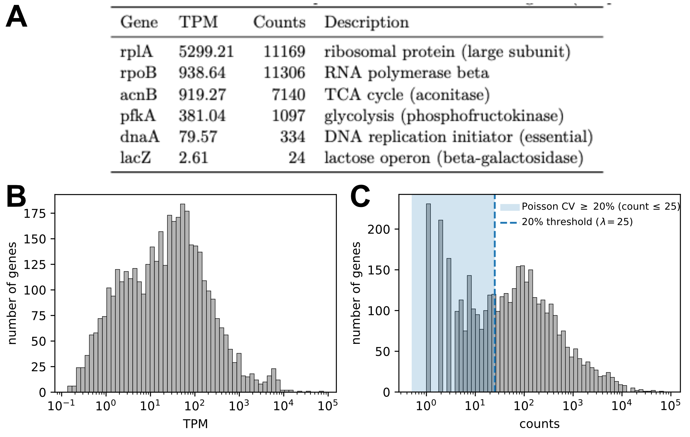
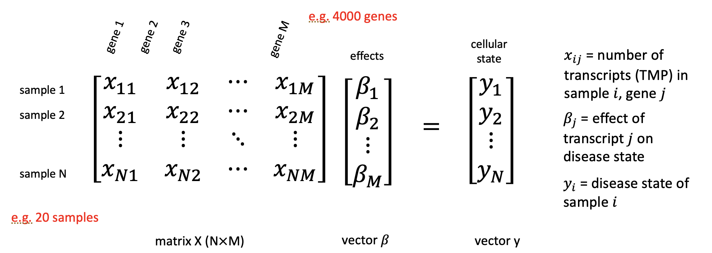

# Omics Data: From Counting to Cellular State

Over the past two decades, advances in sequencing, mass spectrometry, and biochemistry have transformed biology through "omics" measurements. These approaches have shifted biological research from focusing on individual components to studying coordinated, system-wide responses. Exciting! However, proper statistical analysis is crucial for these methods, both to reveal their full potential and to prevent misleading conclusions.

In this section, we discuss the basic analysis steps of omics data. We focus on RNA sequencing to illustrate major analysis principles and highlight key interpretational challenges.

::: callout-note
## Historical context: Omics methods are relatively new

Early large-scale molecular measurements emerged in the late 1990s with DNA microarrays. In the mid-2000s, next-generation sequencing enabled RNA sequencing (RNA-seq), providing higher resolution and dynamic range. In parallel, advances in mass spectrometry drove modern proteomics and metabolomics. Since the 2010s, continued improvements in throughput, cost, and computation have made omics approaches routine tools in systems and biomedical research. Today, multi-omics studies integrating transcriptomic, proteomic, and metabolic data are increasingly common. In parallel, data analysis pipelines have evolved substantially alongside measurement technologies.
:::

## RNA-Seq in a Nutshell

RNA sequencing (RNA-seq) has become one of the most widely used omics technologies, providing insights into the transcriptome and gene expression of cells. RNA-seq measures gene expression by converting cellular mRNA into DNA fragments and counting how often each fragment is sequenced. In a typical experiment, RNA is extracted from cells, converted into complementary DNA (cDNA), fragmented, and prepared as a sequencing library. Millions of short reads are then generated and computationally aligned to a reference genome. The number of reads mapping to each gene provides an estimate of its expression level. In the following we focus on the analysis of RNA-seq data with the counts as a starting point.

## Gene Length, Sequencing Depth, and Normalization of Read Counts

Raw read counts cannot be interpreted directly as expression levels. Two technical factors strongly influence the number of reads assigned to a gene:

- **Library size (sequencing depth):**
  Samples with more total reads have larger counts for all genes. Sequencing depth varies depending on the experimental setup and commonly differs by up to an order of magnitude between samples, see Fig. [-@fig-rnaseq-countsandlengthvariation]A.

- **Gene length:**
  Longer transcripts tend to generate more reads because there is more sequence to sample. For example, in *E. coli*, the lengths of different genes vary by almost two orders of magnitude, as shown in Fig. [-@fig-rnaseq-countsandlengthvariation]B.

{#fig-rnaseq-countsandlengthvariation width="100%"}

As a result, raw counts must be normalized before expression levels can be meaningfully compared. A widely used normalization that accounts for both gene length and sequencing depth is *Transcripts Per Million (TPM)*.

First, read counts are divided by transcript length,
$$\frac{X_g}{L_g},$$
where $X_g$ is the read count and $L_g$ is the length of gene $g$.

These length-corrected values are then rescaled so that they sum to one million within each sample:
$$\mathrm{TPM}_g
=
\frac{X_g / L_g}{\sum_j X_j / L_j}
\times 10^6.$$

By construction, TPM values correct for both gene length and sequencing depth.

::: callout-note
## Info: Historical note: RPKM and its limitations

An earlier and still widely used normalization scheme is *Reads Per Kilobase per Million mapped reads (RPKM)*, which corrects read counts for both gene length and sequencing depth:

$$\mathrm{RPKM}_g
=
\frac{10^9\, X_g}{L_g\, N_s},$$
where $X_g$ is the read count for gene $g$, $L_g$ is its length (in bases), and $N_s$ is the total number of mapped reads in sample $s$. At first glance, this normalization appears to make expression levels directly comparable across samples. However, RPKM normalizes by the total number of mapped reads, which reflects both transcript abundance and gene length. As such, long, highly expressed genes contribute disproportionately to this denominator. It is thus typically better to use TPMs.
:::

## Comparing Transcription Levels Within and Between Samples

Normalization schemes such as TPM provide a convenient way to summarize gene expression levels and allow for the relative comparison of expression levels. Consider as example a culture of *E. coli* growing steadily on glucose. The TPM of ribosomal genes is very high, while the TPM of beta-galactosidase (LacZ) is very low and barely expressed for growth on glucose, see Fig. [-@fig-tmp-example-ecoli]A. Notably, expression levels vary strongly between genes, spanning several orders of magnitude (Fig. [-@fig-tmp-example-ecoli]B). This spread is very common in transcriptomics data and indicates the strong variation with which cells express different genes.

{#fig-tmp-example-ecoli width="100%"}

Importantly, however, TPMs alone do not retain information about the underlying read counts. As such they do not directly quantify counting noise and statistical uncertainty. For example, two genes with similar TPM values may be supported by very different numbers of reads and therefore differ strongly in statistical precision.

## Noise Floors from Counting Statistics

To evaluate measurement uncertainty and make statements about statistical significance, we must consider the statistical properties of count data. Let us first examine the read counts for our example condition, growth on glucose. The distribution of counts for the discussed example is shown in Fig. [-@fig-tmp-example-ecoli]C.

From the previous section on counting noise, we expect uncertainty to be very high when counts are low and to decrease as the number of counts increases. For example, for a pure Poisson process the coefficient of variation (standard deviation compared to mean) scales as $\frac{1}{\sqrt{\langle X \rangle}}$, implying an uncertainty of about $20\%$ when $\langle X \rangle \approx 25$.

Realizing this scaling, we can define a simple noise threshold. For example, expression levels supported by 25 or fewer counts are particularly noisy due to counting noise alone and we should not consider those. While such a treshold provides a useful first guideline it is somewhat arbitrary.
For a more meaningful analysis of measurement noise and statistical uncertainty, we must go beyond such simple thresholds.

Towards a better analysis, let us first consider the variation between two biological replicates. For growth on glucose, the expression levels of both replicates are shown in Fig. [-@fig-tmp-replicates]A. Because raw counts differ due to differences in sequencing depth, we normalize the data to counts per million reads (CPM) here before comparison. The scatter plot reveals strong overall agreement, but also noticeable variation for some genes.

Let's analyze this noise a bit more systematically. If counting noise were the only source of variability, we would expect Poisson statistics, with variance proportional to the mean. In real RNA-seq data, however, the variance is typically larger than predicted by a Poisson model, a phenomenon known as *overdispersion* (see previous section on counting noise).

Importantly, overdispersion is not just a mathematical fit parameter: it reflects both (i) genuine biological variability between replicates (cells are not identical), and (ii) additional technical variability beyond pure counting statistics (e.g. library prep and mapping variability).

To quantify this effect, we plot the observed variance against the mean expression level (Fig. [-@fig-tmp-replicates]B). Despite substantial scatter, a clear trend emerges: the variance increases with the mean and is well described by a negative binomial model with fitted overdispersion parameter $\alpha$.

{#fig-tmp-replicates width="100%"}

In summary, there is substantial variation between replicates. Nevertheless, this variation follows systematic statistical patterns that can be described using counting noise and negative binomial models. This provides the foundation for rigorous statistical tests of differential gene expression.

## Differential Expression

How can we build on this noise consideration to analyze for possible differences in gene expression across experimental conditions. One way to perform this differential expression analysis is the use of the package **DESeq2**.

Conceptually, the differential expression analysis is simple. The key idea is to extract from the data an estimate of counting noise and biological variability, and then ask: under these noise assumptions, are observed differences statistically significant?

Specifically, DESeq2 tests the null hypothesis
$$H_0: \beta_{1g} = 0,$$
that is, that there is no systematic difference in expression of gene $g$ between two conditions.

To probe this null hypothesis, DESeq2 proceeds through several steps:

1.  First, the noise level in the data is analyzed by assuming a negative binomial distribution, with parameters estimated from the data.

2.  Given this noise model and the observed counts, DESeq2 fits a gene-wise generalized linear model and evaluates whether the condition effect (the log fold change) is distinguishable from noise.

3.  The resulting p-values are adjusted to account for multiple-hypothesis testing when probing thousands of genes in parallel. This adjustment follows the Benjamini--Hochberg procedure to control the false discovery rate.

See the following box for more technical details.

::: callout-note
## Info: DESeq2 under the hood: statistical model and hypothesis testing

DESeq2 models RNA-seq counts using a negative binomial distribution. That is, for gene $g$ in sample $s$, the observed count $X_{gs}$ is assumed to follow
$$X_{gs} \sim \mathrm{NB}(\mu_{gs}, \alpha_g),$$
where

- $\mu_{gs}$ is the expected mean count,

- $\alpha_g$ is the gene-specific dispersion (overdispersion) parameter.

This implies
$$\mathrm{Var}(X_{gs}) = \mu_{gs} + \alpha_g \mu_{gs}^2,$$
that is, the variance exceeds the Poisson variance when $\alpha_g>0$. Conceptually, this overdispersion captures both biological variability between replicates and additional technical noise beyond pure counting statistics.

To estimate the dispersion from data, DESeq2 first estimates $\hat{\alpha}_g$ separately for each gene. Because these estimates are noisy, especially for low-count genes, DESeq2 applies shrinkage toward a global mean--dispersion trend, yielding stabilized dispersion values.

With the overdispersion estimated, DESeq2 then performs hypothesis testing, specifically probing the null hypothesis that the expression level of a gene does not differ across conditions.

Formally, the mean count is modeled using a generalized linear model (GLM),
$$\log(\mu_{gs}) = \beta_{0g} + \beta_{1g}\,\mathrm{Condition}_s + \cdots,$$
where $\beta_{1g}$ represents the log fold-change between conditions.

A generalized linear model extends ordinary linear regression by allowing

- non-normal noise distributions (here: negative binomial),

- and a nonlinear link function (here: the logarithm).

This makes it possible to model count data while retaining a linear structure in the parameters.

DESeq2 tests the null hypothesis
$$H_0: \beta_{1g}=0,$$
which corresponds to no differential expression between conditions.

This is done using a Wald statistic, which compares the estimated coefficient to its standard error and yields a p-value. Intuitively, this is analogous to a t-test on the estimated log fold change: it asks whether the observed fold change is large compared to the noise estimated from the data.

Finally, p-values are adjusted using the Benjamini--Hochberg procedure to control the false discovery rate.
:::

## DESeq2 example

As example, let us compare the gene expression of wild type *E. coli* with a mutant strain lacking the transporter `ptsG`. As such, the mutant is not able to grow as fast on glucose as the wild type strain. The dataset contains replicate measurements for both strains, and Python (or R) conveniently provides DESeq2 results with adjusted p-values and estimated fold-changes in expression for all detected genes.

These results are commonly illustrated with a volcano plot, a scatter plot showing p-values versus fold change. For the discussed example, the volcano plot is shown in Fig. [-@fig-deseq2-example]. This is a very convenient way to identify significantly changing genes which then can be probed further. For the shown example, there are for example 744 of of 4506 genes identified which change significantly with a fold change of 2 or more. If we want to understand more how the mutant affects expression we can start with these genes.

{#fig-deseq2-example width="100%"}

## From Differential Expression to Cellular Physiology

DESeq2 is an example of a modern analysis pipeline that integrates state-of-the-art statistical methods and is easy to apply using Python or R. However, as with all statistical tests, it is important to recognize that DESeq2 only probes for statistical significance within the specific modeling framework implemented. Statistical significance alone is neither sufficient nor necessarily indicative of biological relevance. Relying too strictly on a single analysis framework can even obscure important biological insights.

To emphasize this challenge, we discuss particularly two points important when considering DESeq2 results.

- Statistically significant changes in expression do not necessarily reflect gene-specific regulatory mechanisms, highlighting the importance of careful interpretation.

- Biologically important changes may fail to reach statistical significance, for example due to limited statistical power or high variability.

To illustrate these points, we discussed two examples in the lecture. First, constitutively expressed genes, which lack active regulation of RNA polymerase recruitment, can nevertheless show strong expression changes across growth conditions. Second, during diauxic growth and the subsequent transition to acetate utilization, key metabolic genes required for growth on acetate do not always appear as significantly differentially expressed, even though their activity is essential for shaping the observed growth phenotype.

Overall, DESeq2 and differential expression analysis in general are powerful and essential tools for analyzing transcriptomic data. However, meaningful biological interpretation requires integrating these results with physiological knowledge, metabolic context, and complementary measurements.

## The Challenge of Holistic Models Connecting the Transcriptome to Cell States

With these caveats of differential expression analysis in mind, how can we go further and derive biological insights beyond the identification of significant changes? To explore this question, let us first consider an idealized scenario.

Suppose we have measurements of gene expression across different conditions and cellular states. Ideally, we would like to formulate a holistic stochastic model that captures the relationship between transcriptional activity and cellular state so that we can predict one given the other.

To be more explicit, consider a dataset with expression measurements for $M$ genes across $N$ samples. As a first and simplest model, we might attempt to describe the relationship between transcription and a cellular state variable for different samples (e.g. growth rate) using a linear model (Fig. [-@fig-linear-model]).

{#fig-linear-model width="70%"}

Let $\mathbf{y} \in \mathbb{R}^N$ denote a vector describing the cellular state of each sample (e.g. growth rates), and let $\mathbf{X} \in \mathbb{R}^{N \times M}$ denote the matrix of gene expression values, where each row corresponds to a sample and each column to a gene. We then seek a coefficient vector $\boldsymbol{\beta}$ (of length $M$) such that
$$\mathbf{y} \approx \mathbf{X}\boldsymbol{\beta}.$$

Here, the entries of $\boldsymbol{\beta}$ quantify how strongly the expression of each gene contributes to the cellular state. If we would know $\boldsymbol{\beta}$ we could predict the cell state for a given transcriptomic state.

In principle, the vector $\boldsymbol{\beta}$ could be estimated using standard linear regression by minimizing a suitable loss function (as we discussed before). However, a fundamental difficulty arises from the mismatch between the number of genes and the number of samples. While transcriptomes typically contain thousands of genes ($M \gg 1$), the number of samples is often much smaller, for example 10, 20, or 100 ($N \ll M$).

The problem is that in this setting, the regression problem is highly under determined with far more unknown parameters than information on the cell state. As a result, many different coefficient vectors $\boldsymbol{\beta}$ can fit the data equally well, and no unique solution exists (at least without any additional assumptions or constraints).

## Dimensionality reduction

So what can we do? One option would be to return to differential expression analysis alone, as discussed before. However, there is another powerful approach, dimensionality reduction. The central question is this: Can we find a lower-dimensional description of the data that helps us overcome the underdetermination problem, while at the same time providing interpretable biological insights?

Apriori, it is not obvious that such an approach should work. The transcriptome contains thousands of genes, and in principle each gene could vary independently. However, in many biological systems this is not what happens. Instead, gene expression changes occur in highly coordinated ways.

As a powerful example, consider steady bacterial growth not only in a single condition (e.g. glucose), but across multiple growth conditions (e.g. different carbon sources). In principle, a transcriptome with $M = 4500$ genes could explore an enormous $M$-dimensional space of possible expression states. However, empirical data reveal that expression changes are structured and coordinated, effectively constraining the system to a much lower-dimensional manifold.

The dimensionality reduction is massive! To illustrate this idea, we here reconsider the proteomics dataset on bacterial growth introduced earlier, which measures the relative abundance of proteins during steady growth under different conditions. In principle, one could do a similar analysis with transcriptomics data but we used proteomics data here to use the dataset we already introduced.

## Principal Component Analysis

There are several ways to systematically identify and construct lower-dimensional representations of high-dimensional data. One of the most widely used and mathematically straightforward methods is principal component analysis (PCA).

PCA identifies orthogonal directions in data space, called *principal components*, along which the variance of the data is maximal. The first principal component (PC1) captures the largest possible variance, the second component (PC2) captures the largest remaining variance subject to being orthogonal to PC1, and so on. See the box below for a more mathematical treatment. Geometrically, PCA corresponds to finding the best-fitting low-dimensional subspace that approximates the data cloud (see lecture).

We now apply PCA to the proteomics dataset. The dataset we used contains measurements from 7 different experimental conditions. Each condition is represented as a point in the space of principal components, as shown in Fig. [-@fig-pca-example]A.

{#fig-pca-example width="100%"}

Remarkably, the first two principal components already explain about 53% and 22% of the total variance in the data, respectively. That is about $75\%$ of the total variance, highlighting that a low-dimensional structure is present capable of describing describe change in proteome composition with much of the variability in proteome composition being captured by only two degrees of freedom.

To interpret this low-dimensional representation biologically, we next examine how the principal components relate to growth rate as physiological variables. There is a remarkable strong association between PC1 and cellular growth rate (Fig. [-@fig-pca-example]B), suggesting that growth rate is a major organizing variable of the proteome.

To further understand this relationship, we analyze groups of proteins using functional annotations based on Clusters of Orthologous Groups (COGs), a protein classification scheme commonly used. Two major protein fractions emerge which change with princpal component 1 (Fig. [-@fig-pca-example]C). First, proteins involved in translation (COG J), including ribosomal proteins and associated factors, show strong systematic variation. Second, the combined abundance of metabolic proteins (COG C, G, E, and I) also varies prominently. Akkordingly, these two proteome fractions change antagonistically with growth rate: fast-growing cells invest heavily in translation machinery, while slower-growing cells allocate a larger fraction of their proteome to metabolic functions (Fig. [-@fig-pca-example]D).

In summary, this analysis demonstrates that PCA reveals a low-dimensional structure in proteome composition. A very small number of principal components (here two) captures a large fraction of the observed variability and these components correspond to biologically meaningful physiological programs. The realization of these protein sectors, hystorically first realized by a systematic change of ribosome fractions with growth rate lead to the formulation of low-dimensional resource allocation models. These models build on low-dimensional protein sector models and can describe many growth phenotypes with surprising accuracy.

::: callout-note
## Info: The Mathematical Idea Behind Principal Component Analysis

Although PCA is often introduced geometrically, it is based on an elegant linear-algebraic framework. We describe here the mechanics of PCA, but we do not provide a proof for why this works. We recommend the tutorial by Jonathon Shlens[^1]

**Step 1 - Organizing the data as a matrix:**
We begin by arranging the data in a matrix
$$X =
\begin{pmatrix}
x_{11} & x_{12} & \cdots & x_{1M} \\
x_{21} & x_{22} & \cdots & x_{2M} \\
\vdots & \vdots & \ddots & \vdots \\
x_{N1} & x_{N2} & \cdots & x_{NM}
\end{pmatrix},$$
where each row represents one experimental condition (sample), and each column represents one gene or protein. Thus, $N$ is the number of samples and $M$ the number of measured variables. Before applying PCA, the columns of $X$ are usually centered by subtracting their mean values.

**Step 2 - Measuring how variables co-vary:**
From $X$, we construct the covariance matrix
$$C = \frac{1}{N-1} X^\top X ,$$
which summarizes how strongly different genes or proteins vary together across conditions. Large positive entries in $C$ indicate coordinated changes, while small values indicate weak coupling.

**Step 3 - Finding principal directions:** PCA consists of finding the eigenvectors $\mathbf{v}_k$ of the covariance matrix:
$$C \mathbf{v}_k = \lambda_k \mathbf{v}_k .$$

Each eigenvector defines a direction in gene-expression space. The corresponding eigenvalue $\lambda_k$ measures how much variance lies along that direction.

**Step 4 - Changing coordinates:** The original data matrix $X$ is then projected onto these directions:
$$Z = X V ,$$
where $V$ is the matrix whose columns are the eigenvectors in descending order of corresponding eigenvalues; thus eigenvectors are ordered by the amount of variance that direction explains in the data.

The new matrix $Z$ contains the principal components. Its first column is PC1, the second is PC2, and so on.

**Interpretation:** PCA is therefore a coordinate transformation: it rotates the original gene-expression axes into new axes that are ordered by how much biological variability they capture. If only a few eigenvalues are large, the data effectively live in a low-dimensional subspace. This is the mathematical origin of dimensionality reduction.
:::

[^1]: Jonathon Shlens (2005), [*A Tutorial on Principal Component Analysis*](https://www.cs.cmu.edu/~elaw/papers/pca.pdf)
