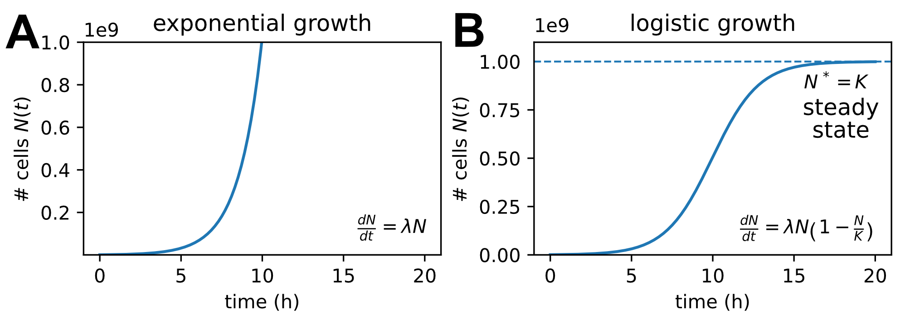

# Differential equation and the modeling of dynamical systems

Omics measurements provide detailed descriptions of cellular states, but they capture only momentary snapshots. Yet cells are not static systems, molecular abundances continuously change through production, degradation, and growth. To understand what we measure, we must therefore adopt a dynamical perspective and describe biological processes explicitly in time. The mathematical tool for this is differential equations, which we introduce in this section.

## A flux perspective to explore biology

To build dynamical models, a useful and unifying perspective is to view biology in terms of *fluxes*, that is, rates at which material, energy, and information flow through biological systems. At every level of organization, living systems are governed by such fluxes. Within cells, metabolic fluxes convert nutrients into biomass; transcriptional fluxes produce RNA; translational fluxes generate proteins. At the level of populations and ecosystems, fluxes determine composition through birth, death, competition, and trophic transfer. At even larger scales, biological activity drives global biogeochemical cycles, with elements such as carbon, nitrogen, and phosphorus continuously circulating between organisms and the environment.

In each case, observed abundances are not fixed properties but the outcome of competing processes unfolding in time. Molecules, cells, and organisms are constantly produced and removed. As a result, biological quantities change according to a simple and remarkably general principle:

$$\text{change} = \text{production} - \text{removal}.$$

## Differential Equations to model fluxes

To describe biological fluxes mathematically, we use differential equations. For a time-dependent quantity $x(t)$, the derivative
$$\frac{dx}{dt}$$
denotes how fast $x$ is changing at a given moment in time $t$. Differential equations state how this rate of change is determined by the state of the system. For example, production rates may depend on substrate availability, enzyme levels, or regulatory signals, while removal rates may depend on degradation machinery or growth.

As a result, biological models are often written in the form
$$\frac{dX}{dt} = P(X,t) - R(X,t),$$
where $P(X,t)$ represents the total production rate and $R(X,t)$ the total removal rate, both of which are functions of the system state $X$ (and possibly time). This is a differential equation. For concrete applications, these functions need to be specified and parametrized based on the specific biology studied. But once set, theses differential equation predict how the system evolves over time.

## Exponential Growth

We illustrate these ideas with a simple but biologically very important example: exponential growth. Consider as example the bacterial growth scenario studied in our reference dataset. If each cell or organism divides at a constant rate per unit time, then the rate of increase of the population is proportional to its current size. This leads directly to the differential equation for the population size $N(t)$:
$$\frac{dN}{dt} = \lambda N,$$
Here, $\lambda$ is commonly called the growth rate.

This differential equation has a simple analytical solution,
$$N(t) = N_0 \, e^{\lambda t},$$
where $N_0$ is the population size at time $t=0$, specifying the initial condition of the system. This initial condition and the growth rate uniquely determine the future trajectory of $N(t)$, see Figure [-@fig-growth-odes]A for an example.

The relevance of exponential growth in biology is hard to overstate. Many fundamental biological processes are autocatalytic: cells and organisms make more of themselves, so larger populations grow faster. The same logic applies at the molecular level: more ribosomes enable faster translation, which in turn produces more ribosomes. The same equation with negative $\lambda$ also describes exponential decay, making it relevant for mRNA degradation, cell death, or dilution through cell division.

## Logistic Growth and Steady States

In real biological environments, exponential growth cannot continue indefinitely. Nutrients become limiting, waste products accumulate, space is finite, and physical and physiological constraints slow reproduction. As populations grow, they increasingly compete with themselves for shared resources. A minimal model that incorporates such effects is logistic growth defined by the following differential equation:
$$\frac{dN}{dt} = \mu N - \mu\frac{N^2}{K}.$$
Here $K$ is called the carrying capacity of the environment. When $N \ll K$, the first term dominates and growth is nearly exponential. As $N$ increases and approaches $K$, the second term becomes more important, growth slows, and the population stabilizes. Figure [-@fig-growth-odes]B illustrates this dynamics.

We logistic equation nicely illustrates an important general concept: the dynamics leads to a stable state. We can identify this behavior directly from the equation without solving it explicitly. At a steady state, the population no longer changes, so we require $dN/dt = 0$, which gives
$$\mu N^* - \mu\frac{(N^*)^2}{K} = 0.$$
This equation has two solutions: $N^* = 0$ (extinction) and $N^* = K$ (the carrying capacity). For growing populations, $N^* = K$ represents a stable steady state toward which the system evolves. Steady states emphasize the dynamic balances that often govern biological systems. Many biological variables, from metabolite concentrations, to mRNA, protein levels, and populations, remain approximately constant over time not because they are static, but because production and removal processes are finely balanced.

{#fig-growth-odes width="100%"}

## More complex differential equations and numerical solutions

In practice, most biologically relevant differential equation models are substantially more complex than the simple growth equations discussed so far. Realistic models often involve many interacting variables, nonlinear feedback, regulatory mechanisms, and multiple timescales. For such systems, explicit analytical solutions are rarely available. However, we can compute their solutions numerically. Numerical methods approximate the continuous dynamics by stepping forward in small time increments and updating the system state iteratively. With modern computational tools, this approach is efficient, reliable, and easy to implement, even for large and highly nonlinear models.

::: callout-note
## Info: Obtaining numerical solutions

The basic idea to numerically solve a differential equation and predict trajectories is to discretize time into small steps $\Delta t$ and approximate the dynamics as a dynamics in discrete timesteps,
$$x(t+\Delta t) \approx x(t) + \frac{dx}{dt}\,\Delta t.$$
Starting from an initial condition, this update rule is applied repeatedly to generate an approximate trajectory. Different algorithms, such as Runge--Kutta methods, follow this idea and refine it to minimize the accumulation of numerical errors. In practice, numerical solvers are conveniently implemented in scientific libraries such as `scipy.integrate` in Python, making simulation of complex biological systems quite easy. However, it is important to keep in mind that numerical errors can occur and it is important to check results for consistency.
:::

The examples of exponential and logistic growth discussed above describe the time evolution of a single variable. In realistic biological systems, however, we often need to track many interacting quantities simultaneously, leading to systems of coupled differential equations. In addition, many processes vary not only in time but also across space. Nutrient concentrations diffuse through tissues, morphogen gradients form during development, and populations spread across landscapes. Describing such spatial dynamics requires extending our models to partial differential equations, which connect derivatives in space and time.

As an important biological example of a multi-variable dynamical system, we now turn to the coupled dynamics of transcription and translation, linking mRNA and protein levels.
