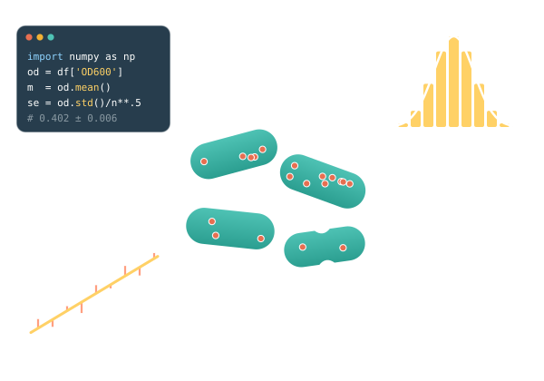

# Welcome {.unnumbered}

::: {.content-visible when-format="html"}

::: {.landing}

::: {.hero .column-screen}
::: {.band-inner}
::: {.hero-text}
[BIO 165/265 · Stanford University]{.hero-kicker}

[Quantitative Approaches in Modern Biology]{.hero-title}

[Quantitative methods and statistics to analyze cell biology — from data
handling and model fitting to uncertainty, hypothesis testing, omics, and
dynamical systems.]{.hero-tagline}

[Start reading <i class="bi bi-arrow-right"></i>](chapters/1a-introduction.qmd){.btn .btn-warning}
[<i class="bi bi-file-earmark-pdf"></i> Download PDF](BIO165-lecture-script.pdf){.btn .btn-outline-light}
:::

::: {.hero-art}
{fig-alt="Coin tosses add up to a binomial distribution — the same statistics that describe molecule counts in cells."}
:::
:::
:::

::: {.coin-band .column-screen}
::: {.band-inner}
## From coin tosses to cells {.unnumbered .unlisted}

[A single coin toss is the simplest random experiment — and the statistical
thread running through this course. Repeating it explains why averages
become reliable, how uncertain an estimate is, and when a difference is real.
The same counting logic then describes sequencing reads, molecule numbers,
and the stochastic gene expression of individual cells.]{.lead}

::: {.coin-path}
[Coin tosses and the law of large numbers [Week 4]{.step-week}](chapters/4a-probabilistic-view-law.qmd){.coin-step}
[Standard error and maximum likelihood [Week 4]{.step-week}](chapters/4b-sampling-variability-standard.qmd){.coin-step}
[Bootstrapping: resampling the tosses [Week 4]{.step-week}](chapters/4c-bootstrapping.qmd){.coin-step}
[Is the coin fair? Hypothesis testing [Week 5]{.step-week}](chapters/5a-hypothesis-testing.qmd){.coin-step}
[From binomial to Poisson counts [Week 6]{.step-week}](chapters/6a-counting-statistics-discrete.qmd){.coin-step}
[Stochastic gene expression [Week 8]{.step-week}](chapters/8c-stochastic-processes.qmd){.coin-step}
:::
:::
:::

::: {.roadmap .column-screen}
::: {.band-inner}
## The course, week by week {.unnumbered .unlisted}

[[Data & models]{.l-data} [Statistics]{.l-stats} [Dynamics]{.l-dyn}]{.legend}

::: {.week-grid}

::: {.week-card}
[Week 1]{.week-n}
[<i class="bi bi-compass"></i>Introduction & getting started]{.week-title}

- [Quantitative reasoning in biology](chapters/1a-introduction.qmd)
- [Python and notebooks](chapters/1b-getting-python-notebooks.qmd)
- [Biological data and tidy data](chapters/1c-biological-data-types.qmd)
:::

::: {.week-card}
[Week 2]{.week-n}
[<i class="bi bi-table"></i>Biological data]{.week-title}

- [Origin, variability, and rigor](chapters/2a-biological-data-origin.qmd)
- [Data visualization](chapters/2b-data-visualization.qmd)
- [Datasets in this course](chapters/2c-datasets-this-course.qmd)
:::

::: {.week-card}
[Week 3]{.week-n}
[<i class="bi bi-graph-up"></i>Fitting and regression]{.week-title}

- [Why regression matters](chapters/3a-fitting-importance-regression.qmd)
- [Linear regression](chapters/3b-linear-regression.qmd)
- [Non-linear regression](chapters/3c-non-linear-regression.qmd)
:::

::: {.week-card .stats}
[Week 4]{.week-n}
[<i class="bi bi-coin"></i>Probability and uncertainty]{.week-title}

- [Probability and the law of large numbers](chapters/4a-probabilistic-view-law.qmd)
- [Standard error of the mean](chapters/4b-sampling-variability-standard.qmd)
- [Bootstrapping](chapters/4c-bootstrapping.qmd)
:::

::: {.week-card .stats}
[Week 5]{.week-n}
[<i class="bi bi-patch-question"></i>Hypothesis testing]{.week-title}

- [Hypothesis testing](chapters/5a-hypothesis-testing.qmd)
- [Multiple hypothesis testing](chapters/5b-multiple-hypothesis-testing.qmd)
:::

::: {.week-card .stats}
[Week 6]{.week-n}
[<i class="bi bi-123"></i>Counting statistics]{.week-title}

- [Counting statistics and discrete measurements](chapters/6a-counting-statistics-discrete.qmd)
:::

::: {.week-card}
[Week 7]{.week-n}
[<i class="bi bi-grid-3x3-gap"></i>Omics and high-dimensional data]{.week-title}

- [Omics data and PCA](chapters/7a-omics-data-counting.qmd)
- [Nonlinear dimensionality reduction (UMAP)](chapters/7b-nonlinear-dimensionality-reduction.qmd)
- [Clustering](chapters/7c-clustering-algorithms.qmd)
:::

::: {.week-card .dyn}
[Week 8]{.week-n}
[<i class="bi bi-activity"></i>Dynamical and stochastic systems]{.week-title}

- [Differential equations](chapters/8a-differential-equation-modeling.qmd)
- [mRNA and protein dynamics](chapters/8b-dynamical-relation-between.qmd)
- [Stochastic processes](chapters/8c-stochastic-processes.qmd)
:::

::: {.week-card .dyn}
[Week 9]{.week-n}
[<i class="bi bi-toggles"></i>Nonlinear dynamics]{.week-title}

- [Feedback, bistability, and bifurcations](chapters/9a-nonlinear-dynamics.qmd)
:::

:::
:::
:::

:::

:::

::: {.about}

## About these notes {.unnumbered}

Welcome to BIO165/265! These lecture notes are meant to support the in-class
lectures and provide additional context and detail. We hope you find them
helpful as you work through the course.

We have newly put these notes together for this year's course, and your
feedback is highly appreciated. Please let us know about typos, unclear
explanations, or suggestions for improvement—your input helps us make these
notes better for everyone. Contact
[Jonas Cremer](https://cremerlab.github.io/contact.html) or open an issue on
[GitHub](https://github.com/cremerlab/BIO165/issues).

*Jonas and Shaili, January 2026*

:::
